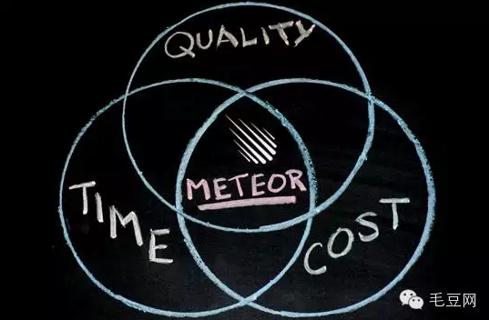
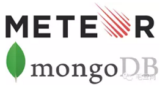

# 毛豆网Meteor全栈技术培训班2016

	Meteor 训练营

随着“互联网+”概念的广泛被提及，传统行业与IT技术的结合越为紧密，高效的全栈开发技术（前端+后端+数据库）成为众多企业及创业公司的技术首选。Meteor，这项源于硅谷的技术产物无疑是全栈开发技术领域的一颗耀眼的新星。

## Meteor是什么？

Meteor技术是一项基于Node.js的全栈开发技术，一套可完成App前端、后端全部实现的开发框架，在短短的3年内已发布其第1.2的正式版本。产品同名的Meteor公司在硅谷由世界孵化器鼻祖YC孵化并投资。由于Meteor技术开发的高效、少人力、低成本等优势，众多国外、国内新兴公司纷纷拥Meteor技术入怀。

## 学习Meteor，能做什么？

学习掌握Meteor技术，可掌握App开发的前端、后端以及数据库全面的体系架构。无论是日后专门从业于Meteor技术相关的公司，还是转向任意技术方向，亦或是自己创业，在技术方面都会游刃有余。

## Meteor中国培训

毛豆网作为国内早期推广Meteor技术的组织，近一年来，已通过宣讲、技术孵化等方式影响了数百位国内技术人员及许多创业公司。应众多创业公司及国内Meteor爱好者的邀请，联合诸位国内Meteor技术大咖，毛豆网决定从2016年伊始，正式开启国内Meteor全栈技术培训及企业委托培养计划，旨在系统培养中国的全栈技术工程师！

## 国内最强Meteor师资

- **李明**，毛豆网创始人兼CEO，IT培训经验10+年，国内早期接触推广Meteor的导师。
- **翟伟明**，清华大学计算机系博士，国内早期从事Meteor项目开发的高级技术工程师，主导过众多Meteor开发项目，拥有丰富Meteor项目经验。
- **田思源**，乐意盟科技CTO，北京交通大学软件学院兼职教授，拥有扎实的Meteor框架知识功底，并正在撰写国内第一本系统的Meteor书籍。
- **郑海子**，“旅行派”公司技术创始人。曾就职于法国居里研究所、中科院研究所等。2013年开始接触Meteor，积累了丰富的项目经验。其公司前端及部分后端均基于Meteor/React技术栈。海子老师在Meteor/React/JavaScript等技术方向极为资深。
- **王一凡**，就职于VMware美国硅谷总部。与李明老师一起接触学习Meteor技术。目前正在创立一家基于Meteor的公司，并致力于引进相关技术。

## 培训后收获

- 掌握Meteor全栈开发框架
- 掌握前后端通讯原理及实现
- 掌握MongoDB数据库
- 掌握前端例如HTML5, CSS的基本技术
- 掌握Discover Meteor经典案例Microscope的完整实现

## 时间和地点

课程安排（2016年1月）

|周六清华 |周一线上 | 周二线上|周三 线上|周四线上 |
|---|---|---|---|---|---|
| 14:00 - 17:00|20:00 - 22:00 | 20:00 - 22:00| 20:00 - 22:00| 20:00 - 22:00| 
|16/23/30日|18/25日|19/26日|20/27日|21/28日| 

共10天的课程，20小时教学时间（周中）+ 12小时总结答疑（周末）

上课地点：清华 FIT 楼

## 课程大纲

- 预备知识及开发环境搭建
  - Tools Required (Meteor, Git/Github...)
  - Meteor Command
  - Prerequisites (HTML5, CSS/LESS, JavaScript)
- Meteor基础
  - Meteor 7 Principles
  - Basic Concept (Template, Event, Helper...)
  - Meteor Deploy
  - Meteor App Structure
- Mongo Database
  - NoSQL vs SQL
  - Connections
  - Schema
  - Database Operation
  - NoSQL Database Modeling
- Meteor进阶（中级课程）
  - Minimongo
  - DDP
  - Publish with UserFields
  - Allow and Deny
- 用户登录设计（实践）
  - Packages Inside
  - Other Login Packages (Weibo/QQ)
  - Meteor.Users应用

## 课前准备

1. 笔记本电脑，最好是Mac OS或Linux系统
2. 提前下载Moxtra客户端，并熟悉其使用方式
3. 申请注册一个Github的账号
4. iOS或者Android手机，USB线连接电脑

## 课程费用及人数

第一期天使学员，由最强师资两周全方位深入教授Meteor，费用仅为999元！
春节后归来还有项目实习或工作实习机会，机不可失！

目标人数：20人 （10人起开班）

## 报名及付款方式

### 报名咨询请扫描下方二维码进入群

### 扫描下方二维码，通过微信支付

### 通过支付宝支付：

支付宝账号：pay@maodou.io(会提示收款人：北京毛豆教育咨询有限公司)

### 银行账号转账：

账户名称：北京毛豆教育咨询有限公司

开户行：招商银行北京海淀黄庄支行

账号：1109 1173 7810 106

如有任何问题，可通过微信咨询毛豆网的小晓/张老师，或是电询 1316-751-8813

